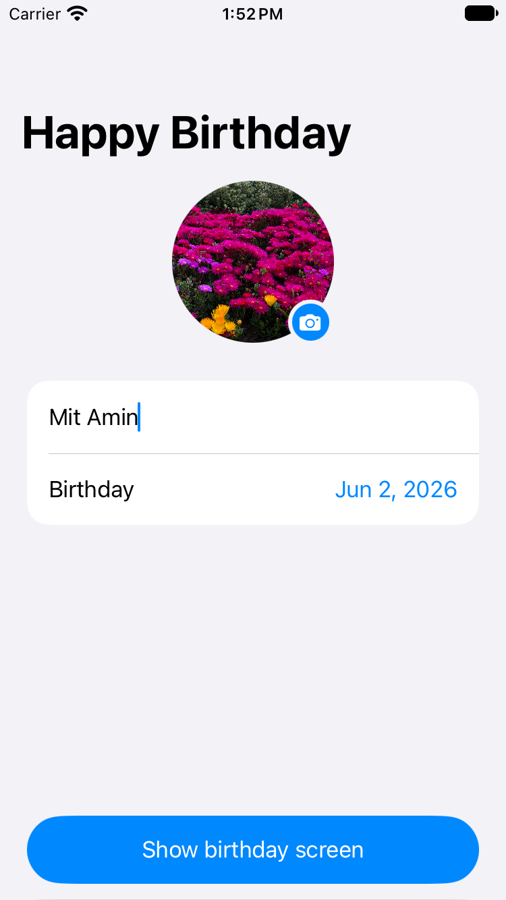
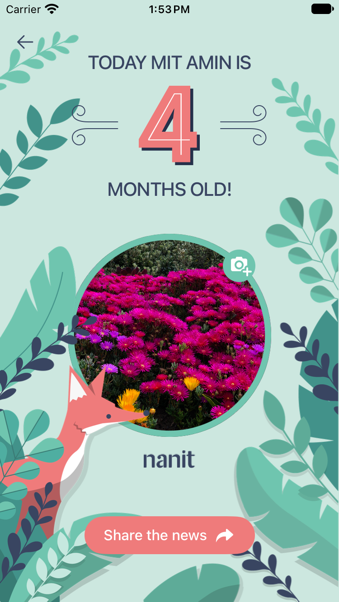

# Happy Birthday

An iPhone app that turns a baby's name, birthday and photo into a shareable "Happy Birthday" card.

## Requirements

- Xcode 26 or later
- iOS 17.0+, iPhone only, portrait only
- No third-party dependencies

Open `HappyBirthday.xcodeproj` and run the `HappyBirthday` scheme. The camera needs a real device; on the simulator the "Take photo" option is hidden and only the photo library is offered.

## Screenshots

<table>
  <tr>
    <td align="center"></td>
    <td align="center"></td>
  </tr>
  <tr>
    <td align="center">Details screen</td>
    <td align="center">Birthday screen</td>
  </tr>
</table>

## What it does

1. **Details screen.** Enter a name, pick a birthday and choose a photo from device or camera. Everything is saved as you type and restored on the next launch. 
    "Show birthday screen" is enabled only when the name is not empty and the birthday is valid.
2. **Birthday screen.** Shows "Today {name} is" with the baby's age in large numbers, the photo in a themed ring, and the Nanit logo. One of three themes (elephant, fox, pelican) is picked at random each time the screen opens.
3. **Change the photo** from the birthday screen with the camera icon on the photo ring.
4. **Share the news** shares an image of the screen without the back button, camera icon or share button.

Age is shown in months until the baby turns one year old, then in years. Birthdays are limited to the last 12 years, because the number artwork covers 0 to 12.

## Project structure

```
HappyBirthday/
├── HappyBirthdayApp.swift          App entry point, owns the shared view model
├── Features/
│   ├── BabyInfoInput/              Details screen, its view model and the date sheet
│   ├── Birthday/                   Birthday screen, canvas, photo ring, theme
│   └── Models/                     BabyInfoDraft, BabyInfo, BabyAge, BabyProfile
├── Services/                       Persistence (BabyInfoStore and implementations)
├── Shared/                         Photo source picker, camera, image downscaling, swipe-back
└── Assets.xcassets                 Backgrounds, placeholders, numbers, icons, colors
```

## Git history

Each step of the assignment is committed and tagged (`step-1` through `step-5`).
